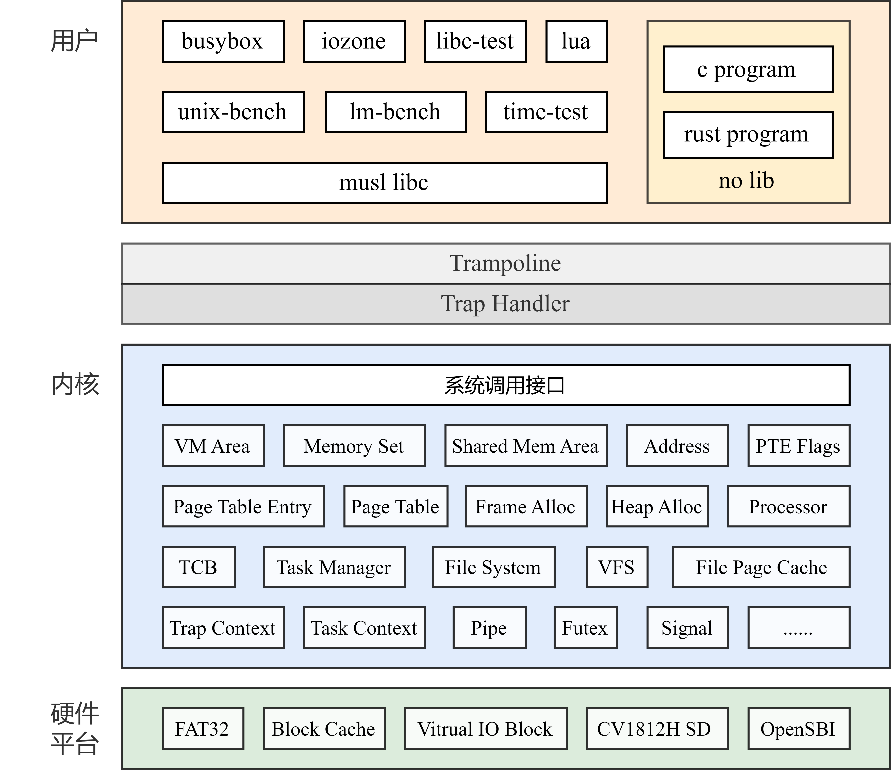

# MyGOS

<div align="center">
  
</div>

### 项目架构

<div align="center">
  
</div>

### 基本环境

WSL2  + Docker 或 Linux + Docker

### 构建运行环境

Makeflie 下配置

```makefile
# 使用 Dockerfile 构建的镜像名
DOCKER_IMAGE_NAME :=
# 使用 docker run 启动的容器名
CONTAINER_NAME :=
# 将主机工作目录挂载到容器内的 /mnt 目录
# (本人的工作目录为为wsl下, D盘的wsl/mygos文件夹下)
WORKPLACE := /mnt/d/wsl/mygos
# 主机端口 (可以随意设置, 但不要冲突)
HOST_PORT := 9090
# 容器端口
CONTAINER_PORT := 9090
# 使用 Dockerfile 构建镜像
build_docker:
	docker build -t ${DOCKER_IMAGE_NAME} .
# 使用 Dockerfile 创建并启动容器
run_docker:
	docker run -p ${HOST_PORT}:${CONTAINER_PORT} --name ${CONTAINER_NAME} -v ${WORKPLACE}:/mnt -w /mnt -it -d ${DOCKER_IMAGE_NAME} bash
# 进入容器
exec_docker:
	docker exec -it ${CONTAINER_NAME} bash
```

### 配置

**QEMU 环境**

kernel/Cargo.toml 的配置默认 features

```toml
default = ["static-busybox", "qemu", "fat32"]
```
kernel/Makefile 中设置 BOARD

```makefile
BOARD ?= qemu
```

项目根目录或者在 kernel 目录下执行  `make run`

**CV1812H 板卡**

kernel/Cargo.toml 的配置默认 features

```toml
default = ["static-busybox", "cvitex", "ramfs"]
```

kernel/Makefile 中设置 BOARD

```makefile
BOARD ?= cv1812h
```

项目根目录或者在 kernel 目录下执行  `make run`

### 文档说明

旧：[BiteTheDisk](docs/BiteTheDisk)

新：[MyGOS](docs/MyGOS) （包括设计文档，其中有软硬件环境搭建的详细配置说明）
