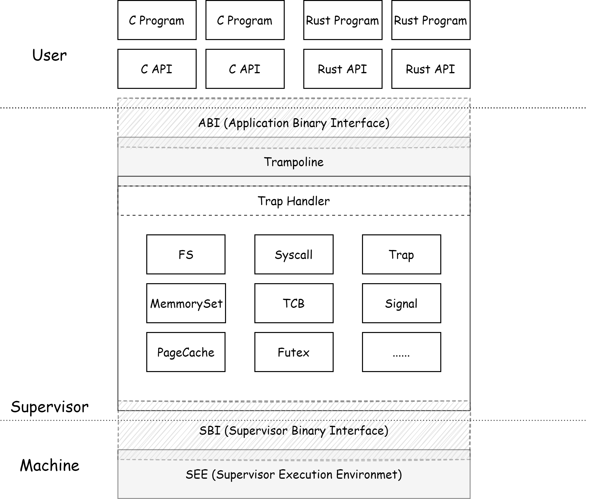
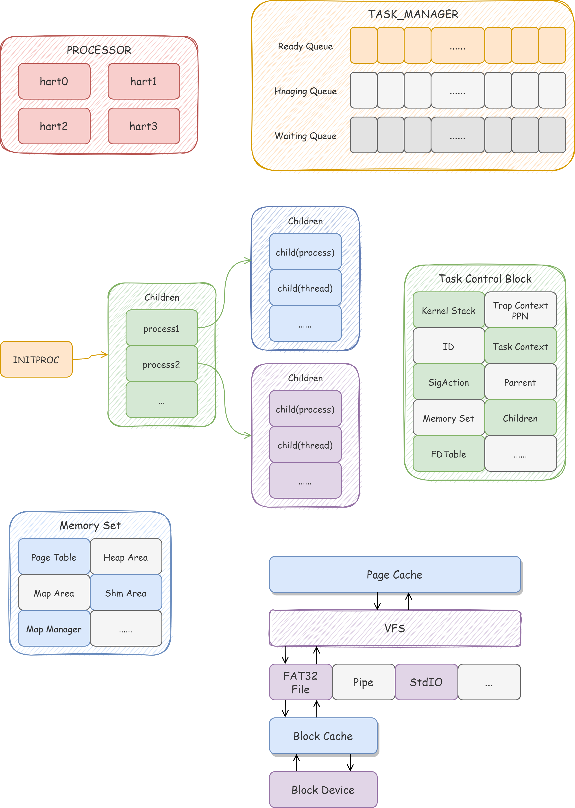

# 系统设计与整体架构

RISC-V架构定义了4种特权级别，其中只有M模式是必须实现的，其余特权级别可以根据运行在CPU上的应用需求进行调整。

BTD OS涉及M/S/U三种特权级别，可以根据运行时的特权级别分为三个部分：

- 用户/应用模式 (U, User/Application)：用户应用程序运行在 U 态。具有最低限度的权限，无法读写特权级寄存器，也无法修改S态和M态的内存空间，只能通过系统调用或异常中断等方式与S态进行交互。
- 监督模式 (S, Supervisor)：操作系统的内核运行在 S 态，是用户程序的运行环境。在这个模式下，内核需要协调调度进程、响应用户的系统调用请求、管理进程的内存空间以及控制设备的IO操作等。
- 机器模式 (M, Machine)：监督模式执行环境 (SEE, Supervisor Execution Environment) 运行在 M 模式上，负责完成与硬件相关的初始化等工作，如在操作系统运行前负责加载操作系统的 Bootloader – RustSBI，是操作系统内核的运行环境。

在 RISC-V 中，各模式使用 ecall 指令与对应模式下的 ret 指令进行特权级切换，对于用户模式（即用户态）切
换到监督模式（即内核态），主要是使用内核提供的提供了 ABI（Application Binary Interface）接口，即 BTD OS 实现的系统调用。对于监督模式切换到机器模式，我们选择使用 [OpenSBI](https://github.com/riscv-software-src/opensbi)，它是运行在更底层的 M 模式特权级下的软件，实现了对硬件的控制，如串口输入输出、多核心启动、操作系统的关机等操作，是操作系统内核的执行环境。

!



### 目录树介绍

```
src
├── board
│   ├── fu740.rs
│   ├── mod.rs
│   └── qemu.rs
├── boards
│   └── qemu.rs
├── console.rs
├── consts.rs
├── drivers
│   ├── fu740
│   │   ├── mod.rs
│   │   ├── plic.rs
│   │   ├── prci.rs
│   │   ├── sdcard.rs
│   │   └── spi.rs
│   ├── mod.rs
│   └── qemu
│       ├── mod.rs
│       ├── virtio_blk.rs
│       └── virtio_impl.rs
├── entry.S
├── fs
│   ├── fat32
│   │   ├── file.rs
│   │   └── mod.rs
│   ├── file.rs
│   ├── mod.rs
│   ├── mount.rs
│   ├── page.rs
│   ├── page_cache.rs
│   ├── pipe.rs
│   └── stdio
│       ├── mod.rs
│       ├── stdin.rs
│       └── stdout.rs
├── logging.rs
├── macros
│   ├── hsm.rs
│   ├── mod.rs
│   ├── on_boot.rs
│   └── profile.rs
├── main.rs
├── mm
│   ├── address.rs
│   ├── frame_allocator.rs
│   ├── kernel_heap_allocator.rs
│   ├── kvmm.rs
│   ├── memory_set.rs
│   ├── mmap.rs
│   ├── mod.rs
│   ├── page_table.rs
│   ├── permission.rs
│   ├── shared_memory.rs
│   ├── user_buffer.rs
│   └── vm_area.rs
├── panic.rs
├── sbi.rs
├── syscall
│   ├── dispatcher.rs
│   ├── errno.rs
│   ├── futex.rs
│   ├── impls
│   │   ├── fs.rs
│   │   ├── futex.rs
│   │   ├── mm.rs
│   │   ├── mod.rs
│   │   ├── others.rs
│   │   └── process.rs
│   └── mod.rs
├── task
│   ├── context.rs
│   ├── id.rs
│   ├── initproc
│   │   ├── busybox
│   │   ├── initproc.S
│   │   ├── mod.rs
│   │   └── test_all_custom.sh
│   ├── kstack.rs
│   ├── manager
│   │   ├── hanging_task.rs
│   │   ├── mod.rs
│   │   └── task_manager.rs
│   ├── mod.rs
│   ├── processor
│   │   ├── mod.rs
│   │   ├── processor.rs
│   │   └── schedule.rs
│   ├── signal.rs
│   ├── switch
│   │   ├── mod.rs
│   │   └── switch.S
│   └── task.rs
├── timer.rs
└── trap
    ├── context.rs
    ├── handler.rs
    ├── mod.rs
    └── trampoline.S
```

